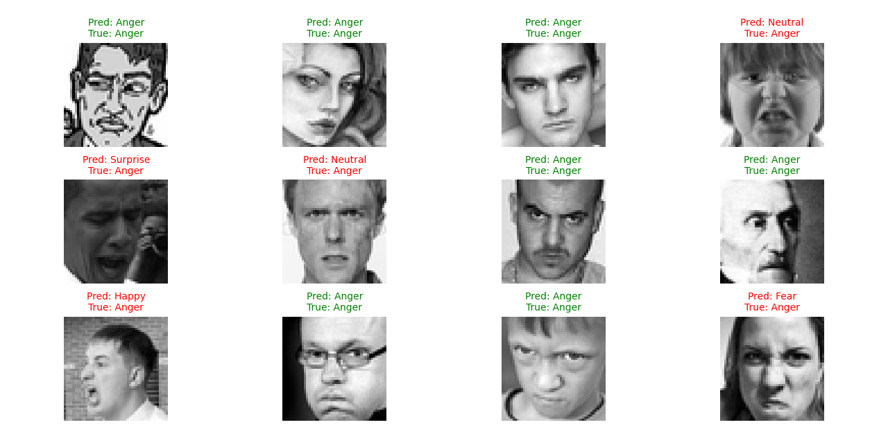
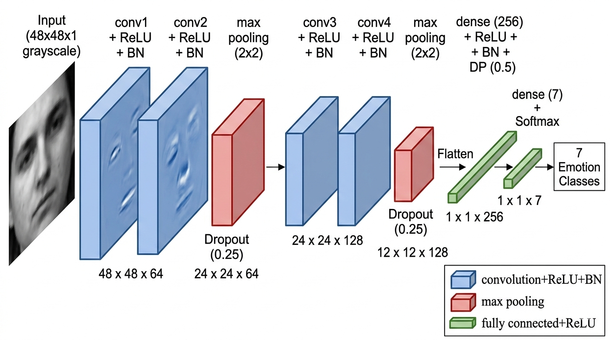

# Emotion Detection using CNN (TensorFlow / Keras)

A deep learning-based facial emotion recognition system trained on grayscale facial images using Convolutional Neural Networks (CNN).



This project supports:

- Model training with data augmentation
- Automatic model saving / loading
- Best-weight checkpointing
- Single image prediction
- Probability visualization using Matplotlib

---

## Project Structure
```
EmotionDetection/
│
├── emotion_detection/                # Dataset directory
│   ├── train/                        # Training images (7 emotion classes)
│   └── test/                         # Testing images
│
├── saved_models/                     # Auto-saved trained models
│   ├── latest_model.keras
│   └── best_weights.weights.h5
│
├── main.py                           # Training pipeline
├── predict_single_image.py           # Single-image inference script
├── requirements.txt                  # Dependencies
└── README.md                         # Project documentation
```

---

## Model Architecture



### Emotion Classes

- Anger
- Disgust
- Fear
- Happy
- Neutral
- Sadness
- Surprise

---

## Installation

### 1️. Clone repository
git clone https://github.com/vegetablechicken5437/EmotionDetection.git

cd EmotionDetection


### 2️. Install dependencies


pip install -r requirements.txt


---

## Training


python main.py


Behavior:

- If no saved model exists → training starts
- Best weights saved automatically
- Final model saved to:


saved_models/latest_model.keras

---

## Single Image Prediction


python predict_single_image.py path_to_image.jpg


Example:


python predict_single_image.py test.jpg


Output:

- Predicted emotion
- Confidence score
- Image displayed with prediction
- Probability distribution bar chart

---

## Features

- Data Augmentation  
- Automatic Checkpoint Saving  
- EarlyStopping  
- ReduceLROnPlateau  
- Auto Load Existing Model  
- Matplotlib Visualization  
- Clean Modular Inference Script  

---

## Requirements

- Python 3.9+
- TensorFlow 2.10+
- OpenCV
- NumPy
- Matplotlib
- Pandas

---
